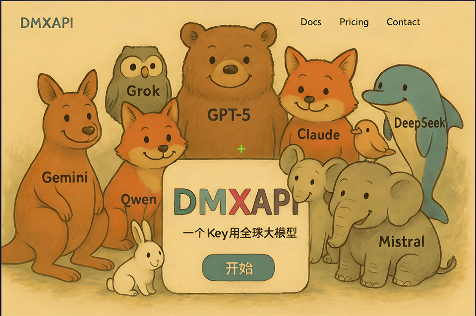

# My-neuro

  <a href="./README_English.md">English</a> | <a href="./README.md">中文</a>

## For deployment process of this project, please visit the official website: [Click here to visit official website](http://mynewbot.com/tutorials)

#### The goal of my-neuro is to create your own personal AI character, crafting an AI companion that approaches real human behavior - through your data and notes, shaping the ideal image of TA in your mind.

#### This project is inspired by neuro sama, hence the name my-neuro (a name provided by the community). The project can train voice, personality, and replace appearances. Your imagination is as rich as the model can be close to your expectations. This project is more like a workbench. Using packaged tools, step by step you can personally design and realize your ideal AI image.

#### If you want to use fully local inference, using local Large Language Models (LLM) for inference or fine-tuning, not based on third-party APIs, you can enter the LLM-studio folder, which contains guidance for local model inference and fine-tuning.

### If you want to use closed-source AI models, we recommend using [DMXAPI](https://www.dmxapi.cn)
### Supports unified calls to most mainstream AI models on the market.

## Roadmap

### Model Support
- [x] Open-source models: Support open-source model fine-tuning and local deployment
- [x] Closed-source models: Support closed-source model integration

### Core Features
- [x] Ultra-low latency: Full local inference, conversation latency under 1 second
- [x] Synchronized subtitle and voice output
- [x] Voice customization: Support for male/female voices, various character voice switching, etc.
- [x] MCP support: Can use MCP tools for integration
- [x] Real-time interruption: Support voice and keyboard interruption of AI speech
- [ ] Realistic emotions: Simulate real human emotional state changes, with its own emotional state
- [ ] Super realistic human-machine experience (similar to real human interaction design, stay tuned)
- [x] Actions and expressions: Display different expressions and actions based on conversation content
- [x] Integrated visual capabilities: Support image recognition and determine when to activate visual functions through language intent
- [x] Voice model (TTS) training support, using gpt-sovits open-source project by default
- [x] Subtitle display in Chinese, audio playback in foreign language. Can be freely enabled/disabled (suitable for character roles where TTS model itself is in a foreign language)

### Extended Features
- [x] Desktop control: Support voice control to open software and other operations
- [x] AI singing (Feature sponsored by: [@jonnytri53](https://github.com/jonnytri53), special thanks)
- [ ] Integration with international streaming platforms
- [x] Live streaming function: Can stream on Bilibili platform
- [x] AI teaching: Choose a topic and have AI teach you. You can ask questions midway. For specialized courses, materials can be inserted into the database for AI understanding
- [x] Replace various live 2d models
- [ ] Web page interface support (already completed, will be integrated soon)
- [x] Text conversation: Can type and communicate with AI via keyboard
- [x] Active conversation: Actively initiates conversation based on context. Current version V1
- [x] Internet access: Real-time search for latest information
- [x] Mobile app: Can chat with FeiNiu on Android phones
- [x] Play sound effects from sound library, with model deciding which sound effects to play
- [x] Game companionship: Model and user play cooperative, party, puzzle games together. Current experimental games include: Draw & Guess, Monopoly, Galgame, Minecraft, etc. (Currently integrated: Minecraft, Galgame)
- [x] Long-term memory: Let the model remember your key information, your personality, and temperament

### Features the Model Wants (Under Consideration)
- [ ] Screen color change: Change screen color to disturb user based on model's mood
- [ ] Free movement: Model freely moves around the screen

## Closing Thoughts

I will incorporate my years of experience and understanding of technology into this project. The name "my neuro" not only rides on the popularity of neuro sama, but more importantly expresses my imagination and expectations for the boundaries of AI.

I hope for a true AI companion that can understand you, comprehend you, and never find you boring by your side. Sad together when sad, happy together when happy. Bringing characters from film and TV works, novels, and fantasies into reality.

Not just simple chat interaction. I hope it can integrate into life and become an emotional individual. Playing games together, watching videos together, learning things together, chatting before sleep, waking you up, silently watching you work in a daze, quietly remembering what you've done. Having emotions, having its own emotional state. Truly getting angry.

Having emotional changes every day, having its own things it wants to do. Being upset for a long time about certain words. Being happy for a long time about certain words. Remembering every moment experienced together with you. A being that continuously understands you.

However, most importantly, its personality, appearance, voice, emotional changes, etc., are all decided by you. Like clay, we provide the best tools and ensure every module fits together. But what it ultimately becomes is for you to construct.

However, for friends who don't want the hassle, this project also directly packages a character - FeiNiu (fake neuro). It's a character that copies neuro sama, but I've set its personality to be scheming, tsundere, funny, and a bit temperamental, but occasionally shows a gentle side.

More importantly, I hope to learn from and understand neuro, then try to create new content. Things that suit oneself.

I'm particularly passionate about this project. Currently, the project has achieved nearly 30% of planned functionality, including personality definition and memory. In the near future, I'll focus on core personality traits - that is, truly human-like, with sustained emotions. Within 2 months, I'll realize the most human-like part, which is long-term emotional state. At the same time, features like playing games together, watching videos, waking you up, etc., will all be basically completed before June 1st, reaching 60% completion.

I hope to realize all the above ideas this year.

## Star History

## Acknowledgments

QQ Group: Thanks to Jasmine Tea for helping create the FeiNiu app icon

Thanks to the following users for their financial support:
- [jonnytri53](https://github.com/jonnytri53) - Thank you for your support! Donated $50 USD to this project
- [Radish Head](https://space.bilibili.com/92419729?spm_id_from=333.337.0.0) - Thank you for your strong support! Donated 1000 RMB to this project
- [Eastern Moon Chen DFYC](https://space.bilibili.com/670385648?spm_id_from=333.337.0.0) - Thank you for your support! Continuously donated 100 RMB monthly from August to October, totaling 300 RMB
- [Big Rice Ruoye](https://space.bilibili.com/3546392377166058?spm_id_from=333.337.0.0) - Thank you for your support! Donated 68 RMB to this project
- [StrongerFatTiger](https://space.bilibili.com/28869393?spm_id_from=333.337.0.0) - Thank you for your support! Donated 100 RMB to this project

Open-source projects integrated into this project:

TTS:
https://github.com/RVC-Boss/GPT-SoVITS

AI playing Minecraft:
https://github.com/mindcraft-bots/mindcraft